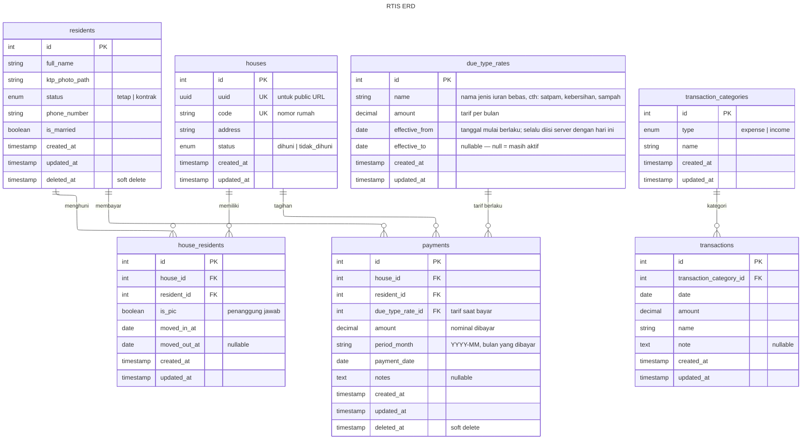

# RTIS (Sistem Informasi Administrasi RT)

RTIS (Sistem Informasi Administrasi RT) adalah aplikasi web terpusat yang dirancang untuk mengelola administrasi RT secara efisien. Aplikasi ini memungkinkan pengurus RT untuk mengelola data penghuni, rumah, iuran standar (keamanan dan kebersihan), pengeluaran operasional, serta pembayaran bulanan. Selain itu, RTIS menyediakan portal publik yang transparan dan *read-only* di mana warga dapat memeriksa status tagihan mereka dan melihat laporan keuangan lingkungan tanpa perlu melakukan login.

## 🛠 Tech Stack

- **Backend:** Laravel 13.x
- **Frontend:** React 19.x with strict TypeScript, Zustand, Tailwind CSS 4.x (Vite)
- **Database:** MySQL 8.x

## 💻 Environment Requirements (Persyaratan Sistem)

Sebelum menjalankan aplikasi, pastikan sistem Anda memenuhi persyaratan berikut:
- **PHP** >= 8.2
- **Composer** (untuk instalasi dependensi backend)
- **Node.js** >= 18.x
- **NPM** atau **Yarn** (untuk instalasi dependensi frontend)
- **MySQL** >= 8.0

## ⚙️ Quick Start

### Instalasi di macOS
1. **Clone repository ini**
2. **Setup Backend:**
   ```bash
   cd backend
   cp .env.example .env
   # Update DB_DATABASE, DB_USERNAME, DB_PASSWORD di dalam .env (jika berbeda dari example)
   # Atur ADMIN_PASSWORD untuk login ke dashboard admin (default: `secret`)

   composer install
   php artisan key:generate
   php artisan storage:link
   php artisan migrate:fresh --seed
   php artisan serve
   ```
3. **Setup Frontend:**
   ```bash
   cd frontend
   npm install
   cp .env.example .env
   # Atur BACKEND_URL (jika berbeda dari example)

   npm run dev
   ```

### Instalasi di Windows
1. **Clone repository ini**
2. **Setup Backend:**
   ```cmd
   cd backend
   copy .env.example .env
   # Update konfigurasi DB dan ADMIN_PASSWORD di dalam .env (jika berbeda dari example, default password: `secret`)

   composer install
   php artisan key:generate
   php artisan storage:link
   php artisan migrate:fresh --seed
   php artisan serve
   ```
3. **Setup Frontend:**
   ```cmd
   cd frontend
   npm install
   copy .env.example .env
   # Atur BACKEND_URL (jika berbeda dari example)

   npm run dev
   ```

### 🔄 Reset Data / Data Demo
Jika Anda ingin me-reset keadaan database agar datanya kembali bersih dan rapi seperti sedia kala (sangat berguna untuk keperluan demo atau testing ulang), Anda cukup menjalankan perintah berikut di dalam folder `backend`:
```bash
php artisan migrate:fresh --seed
```
Perintah ini akan menghapus semua data yang ada dan mengisinya kembali dengan data dummy awal.

## 🗄 Database Schema (ERD)



- `users`: Menyimpan data autentikasi administrator (Admin RT).
- `houses`: Menyimpan informasi rumah (blok, nomor, status) dan UUID unik untuk akses publik.
- `residents`: Menyimpan detail penghuni, termasuk foto KTP yang bersifat rahasia.
- `house_resident`: Tabel pivot yang melacak penempatan penghuni pada rumah (many-to-many) beserta riwayat masuk/keluar.
- `due_type_rates`: Mengelola jenis iuran yang dibuat dinamis beserta tarif aktifnya seiring waktu.
- `transaction_categories`: Mendefinisikan kategori untuk pemasukan dan pengeluaran operasional.
- `payments`: Melacak pembayaran iuran bulanan yang terkait dengan rumah tertentu dan tarif jenis iurannya.
- `transactions`: Mencatat pemasukan dan pengeluaran operasional lainnya di luar iuran bulanan.

## 🏗 Arsitektur

RTIS dibangun dengan arsitektur terpisah (decoupled):
- **Backend (Laravel):** Bertindak murni sebagai server API, menggunakan Sanctum untuk autentikasi SPA berbasis cookie. Logika bisnis diabstraksi ke dalam *Services* sehingga *Controller* tetap ramping. Gambar KTP disimpan di disk privat dan disajikan melalui endpoint API yang dilindungi.
- **Frontend (React):** *Single Page Application (SPA)* yang menggunakan Vite, mengambil data dari backend melalui endpoint REST standar. State dikelola menggunakan *custom hooks* dan Zustand. Mengimplementasikan penjagaan rute (*route guarding*) yang ketat untuk dashboard dan mengizinkan rute publik untuk fitur pelaporan.

## 🚀 Fitur & Demo Aplikasi

Di bawah ini adalah penjelasan detail dari semua fitur yang diimplementasikan dalam RTIS, beserta tangkapan layar yang mendemonstrasikan fungsionalitas aplikasi.

### 1. Autentikasi & Keamanan
Aplikasi ini memiliki panel admin yang aman, dilindungi oleh sistem autentikasi SPA berbasis cookie (Laravel Sanctum). Hanya pengurus RT yang berwenang yang dapat mengakses sistem ini.


### 2. Dashboard & Ringkasan Keuangan
Dashboard memberikan ringkasan instan mengenai kesehatan keuangan RT, termasuk:
- Total Saldo Kas Berjalan.
- Pemasukan dan Pengeluaran untuk bulan berjalan.
- Metrik keterisian/okupansi rumah.
- Grafik batang historis 12 bulan yang membandingkan Pemasukan vs Pengeluaran.


### 3. Manajemen Rumah
Admin dapat menambah, mengedit, dan melihat semua rumah di lingkungan RT, serta melacak apakah rumah tersebut dihuni atau kosong.


**Detail & Riwayat Rumah:** Mengklik sebuah rumah akan menampilkan riwayat pembayaran penuh selama satu tahun dan catatan penghuni masa lalu maupun masa kini yang pernah tinggal di sana.


### 4. Manajemen Penghuni
Daftar komprehensif seluruh penghuni yang terdaftar. Admin dapat mengunggah foto KTP secara aman (yang disimpan di disk lokal privat untuk mencegah akses publik).


**Pendaftaran Penghuni:** Formulir modal yang rapi memungkinkan entri data dan penempatan rumah secara cepat. Penghuni dapat memiliki foto KTP yang diunggah dan dilihat secara aman di dalam sistem.


### 5. Konfigurasi Aplikasi
Manajemen dinamis untuk kategori transaksi default dan iuran bulanan standar (misal: Satpam & Kebersihan). Admin dapat mengatur tarif aktif, dan sistem secara otomatis menutup tarif lama untuk menjaga integritas riwayat pembayaran.


### 6. Matriks Pembayaran Bulanan
Inti dari sistem keuangan. Tabel matriks interaktif yang melacak status pembayaran setiap rumah yang dihuni untuk setiap bulan sepanjang tahun. Mendukung pembayaran penuh, cicilan sebagian, dan pembayaran tahunan sekaligus.


**Mencatat Pembayaran:** Mengklik sel bulan yang berstatus belum bayar akan membuka modal untuk dengan mudah mencatat pembayaran untuk rumah dan periode tersebut.


**Alat Generate URL Tagihan:** Alat efisien yang dirancang untuk menghasilkan daftar URL pembayaran publik yang siap disalin-tempel untuk semua penghuni yang memiliki tunggakan di bulan tertentu, dioptimalkan untuk dibagikan melalui WhatsApp.


### 7. Transaksi Operasional
Catatan untuk pemasukan dan pengeluaran operasional di luar iuran bulanan standar. Termasuk kategorisasi untuk pelaporan keuangan yang rapi.


**Catat Transaksi:** Formulir yang mudah digunakan untuk mencatat arus kas masuk dan keluar.


### 8. Portal Transparansi Publik
Penghuni memiliki akses ke tampilan tertentu tanpa perlu login, memastikan transparansi maksimal.

**Halaman Tagihan Publik:** URL unik untuk setiap rumah yang memungkinkan penghuni untuk melihat riwayat pembayaran pasti mereka, rincian iuran, dan tunggakan yang belum dilunasi.


**Laporan Keuangan Publik:** Ringkasan tingkat tinggi mengenai keuangan RT, menyediakan grafik dan rincian pengeluaran untuk menunjukkan kepada penghuni secara persis bagaimana dana RT digunakan.


### 9. Responsif Penuh & Ramah Seluler (Mobile-Friendly)
Seluruh aplikasi web—mulai dari matriks pembayaran yang kompleks hingga portal publik—sepenuhnya responsif, memastikan admin RT dan penghuni mendapatkan pengalaman yang lancar di perangkat apa pun hingga ke tampilan seluler.


