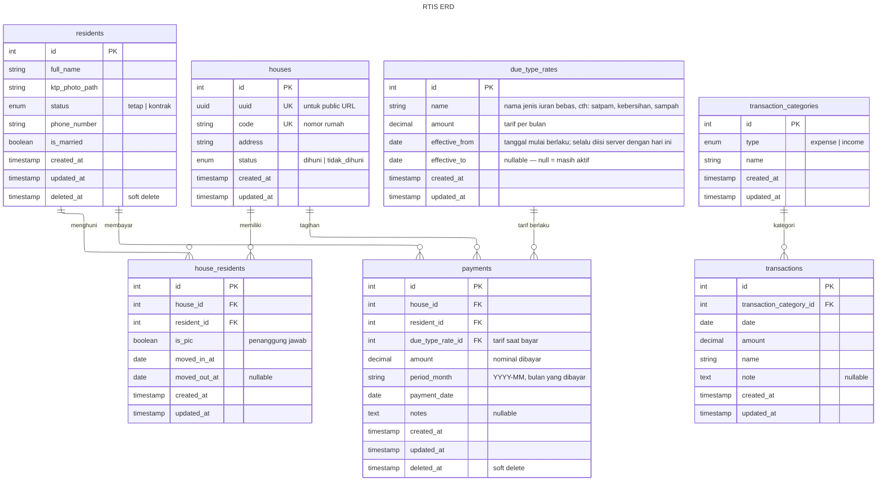

# PRD — RTIS (Sistem Informasi Administrasi RT)

## 1. Summary

RTIS adalah aplikasi web untuk mengelola administrasi keuangan dan data kependudukan di tingkat RT pada sebuah perumahan elite. Aplikasi ini memungkinkan RT untuk mencatat penghuni, mengelola data rumah, merekam pembayaran iuran bulanan (satpam & kebersihan), mencatat pengeluaran operasional, serta menghasilkan laporan keuangan visual yang bisa dibagikan secara publik untuk transparansi kepada warga.

Aplikasi dibangun dengan arsitektur **backend-frontend terpisah** menggunakan **Laravel (REST API) + React (SPA) + MySQL**, dengan prinsip separation of concerns untuk kemudahan maintenance jangka panjang.

---

## 2. Contacts

| Nama | Peran | Catatan |
|------|-------|---------|
| (RT/Pengguna Utama) | Product Owner / End User | Satu-satunya admin yang mengelola seluruh sistem |
| (Developer) | Full Stack Developer | Bertanggung jawab atas development & deployment |

---

## 3. Background

### Konteks

Sebuah perumahan elite memiliki **20 rumah** dengan komposisi:
- **15 rumah** dihuni tetap
- **5 rumah** terkadang kosong atau diisi penghuni kontrak sementara

Setiap rumah yang berpenghuni wajib membayar iuran bulanan:
- **Iuran Satpam**: Rp 100.000/bulan
- **Iuran Kebersihan**: Rp 15.000/bulan

Selain pemasukan dari iuran, RT juga mengelola **pengeluaran operasional** seperti gaji satpam, token listrik pos satpam, perbaikan jalan, perbaikan selokan, dan lain-lain.

### Mengapa Sekarang?

Saat ini pengelolaan administrasi masih dilakukan secara manual, yang menyebabkan:
- Kesulitan melacak siapa yang sudah atau belum bayar
- Tidak ada catatan historis penghuni per rumah yang terstruktur
- Laporan keuangan sulit disusun dan tidak transparan untuk warga
- Pengelolaan rumah kosong/kontrak yang sering berubah-ubah penghuni sulit dilacak

### Apa yang Baru Menjadi Mungkin?

Dengan aplikasi web berbasis modern stack, RT dapat memiliki sistem digital yang:
- Berjalan di lokal maupun server
- Bisa diakses warga melalui URL publik tanpa login
- Memberikan transparansi keuangan secara real-time

---

## 4. Objective

### Tujuan Utama

Menyediakan **satu aplikasi terpusat** bagi RT untuk mengelola seluruh administrasi perumahan — mulai dari data penghuni, status rumah, pembayaran iuran, hingga laporan keuangan — dengan cara yang **mudah, transparan, dan terstruktur**.

### Manfaat

| Untuk RT | Untuk Warga |
|----------|-------------|
| Pencatatan penghuni & rumah yang terstruktur | Bisa cek status pembayaran sendiri via URL |
| Rekam pembayaran iuran dengan mudah | Laporan keuangan transparan bisa dilihat publik |
| Laporan keuangan otomatis (grafik) | Mengetahui penggunaan dana iuran |
| Histori penghuni per rumah tercatat | — |

### Key Results (SMART)

| # | Key Result | Target | Cara Ukur |
|---|-----------|--------|-----------|
| KR1 | RT dapat mencatat pembayaran iuran untuk seluruh rumah berpenghuni dalam 1 sesi | < 10 menit | Waktu yang dihabiskan RT untuk input data bulanan |
| KR2 | Laporan bulanan & tahunan tersedia secara otomatis | 100% akurat | Cross-check saldo dengan data transaksi |
| KR3 | Warga dapat mengecek status pembayarannya sendiri | Tanpa bantuan RT | Akses via URL publik |
| KR4 | Histori penghuni per rumah tercatat lengkap | 100% rumah | Data historis tersedia dan akurat |

---

## 5. Market Segment(s)

### Pengguna Utama: Ketua RT

- **Masalah**: Mengelola administrasi keuangan dan data warga secara manual sangat menyita waktu dan rawan kesalahan
- **Kebutuhan**: Alat digital yang sederhana untuk mencatat, melacak, dan melaporkan seluruh aktivitas administrasi
- **Batasan**: Bukan orang teknis, butuh UI yang intuitif dan straightforward

### Pengguna Sekunder: Warga/Penghuni

- **Masalah**: Tidak tahu apakah pembayaran mereka sudah tercatat atau belum, dan tidak tahu dana iuran digunakan untuk apa
- **Kebutuhan**: Akses mudah (tanpa login) untuk melihat status pembayaran dan laporan keuangan RT
- **Batasan**: Hanya perlu akses baca (read-only), tidak perlu interaksi kompleks

---

## 6. Value Proposition(s)

### Jobs-to-be-Done

| Job | Solusi RTIS |
|-----|-------------|
| "Saya perlu tahu siapa yang sudah bayar bulan ini" | Dashboard pembayaran dengan status per rumah per bulan |
| "Saya perlu catat penghuni baru yang kontrak" | Form penghuni dengan status kontrak/tetap dan tanggal opsional |
| "Saya perlu lihat total pemasukan vs pengeluaran" | Grafik keuangan tahunan dengan breakdown bulanan |
| "Warga minta bukti pembayaran" | Halaman publik status pembayaran per rumah via unique UUID URL |
| "Warga mau tahu uang iuran dipakai apa" | Halaman publik laporan keuangan dengan detail pengeluaran per kategori |
| "Saya perlu kirim tagihan ke semua warga" | Generate daftar tagihan + unique URL per rumah, siap di-share |
| "Tarif iuran naik, perlu update" | Konfigurasi tarif iuran bisa diubah langsung dari UI |

### Keunggulan vs Alternatif

| Aspek | Manual / Excel | RTIS |
|-------|---------------|------|
| Pencarian data | Lambat, scroll-scroll | Instant, terfilter |
| Histori penghuni | Tidak tercatat | Otomatis tercatat |
| Laporan keuangan | Harus buat manual | Auto-generated, visual |
| Transparansi warga | Harus kirim 1-1 | URL publik, real-time |
| Pembayaran tahunan | Sulit tracking | 1 transaksi, status bulanan otomatis |
| Share tagihan | Harus kirim 1-1, manual | Auto-generate list URL per rumah |

---

## 7. Solution

### 7.1 UX / User Flows

#### Flow RT (Admin)

```
Login (password dari ENV)
    │
    ├── Dashboard
    │   ├── Ringkasan keuangan bulan berjalan
    │   ├── Jumlah rumah dihuni / kosong
    │   └── Quick stats: tunggakan, saldo
    │
    ├── Kelola Penghuni
    │   ├── Daftar penghuni (search, filter by status)
    │   ├── Tambah penghuni (form + upload KTP)
    │   └── Edit penghuni
    │
    ├── Kelola Rumah
    │   ├── Daftar rumah (grid/list, status dihuni/kosong)
    │   ├── Detail rumah
    │   │   ├── Penghuni saat ini
    │   │   ├── Histori penghuni
    │   │   └── Histori pembayaran
    │   ├── Tambah/edit rumah
    │   └── Assign/remove penghuni
    │
    ├── Kelola Pembayaran
    │   ├── Tabel pembayaran bulan ini (per rumah)
    │   ├── Catat pembayaran (pilih rumah → jenis iuran → periode)
    │   └── Pembayaran tahunan (1 transaksi, cover 12 bulan per jenis iuran)
    │
    ├── Kelola Pengeluaran
    │   ├── Daftar pengeluaran (filter by bulan, kategori)
    │   ├── Tambah pengeluaran (kategori + deskripsi + nominal)
    │   └── Edit/hapus pengeluaran
    │
    ├── Laporan Keuangan
    │   ├── Grafik pemasukan vs pengeluaran (12 bulan)
    │   ├── Detail per bulan (pemasukan + pengeluaran)
    │   ├── Breakdown pengeluaran per kategori
    │   └── Share link (URL publik)
    │
    ├── Generate Tagihan
    │   ├── List tagihan bulan ini per rumah + unique URL
    │   └── Salin URL per warga untuk di-share
    │
    └── Pengaturan
        └── Konfigurasi tarif iuran (satpam & kebersihan)
```

#### Flow Warga (Public)

```
Akses URL publik (tanpa login)
    │
    ├── Tagihan Rumah (via unique UUID URL: /tagihan/{uuid})
    │   ├── Info rumah & penghuni
    │   ├── Status pembayaran per bulan (tahun berjalan)
    │   └── Detail tunggakan jika ada
    │
    └── Laporan Keuangan RT (/laporan)
        ├── Grafik pemasukan vs pengeluaran
        └── Detail pengeluaran per kategori per bulan
```

---

### 7.2 Key Features

#### F1: Manajemen Penghuni

| Aspek | Detail |
|-------|--------|
| **Deskripsi** | CRUD data penghuni perumahan |
| **Atribut** | Nama lengkap, foto KTP (upload gambar), status (tetap/kontrak), nomor telepon, status menikah (ya/tidak), tanggal mulai kontrak (opsional), tanggal berakhir kontrak (opsional) |
| **Validasi** | Nama & nomor telepon wajib. Foto KTP wajib (format: jpg, png, max 5MB). Nomor telepon format Indonesia |
| **Catatan** | Penghuni yang sudah di-assign ke rumah tidak bisa dihapus, hanya di-unassign. Soft delete untuk menjaga integritas data historis |

#### F2: Manajemen Rumah

| Aspek | Detail |
|-------|--------|
| **Deskripsi** | CRUD data rumah dan asosiasi dengan penghuni |
| **Atribut rumah** | Nomor/kode rumah, alamat/blok, status (dihuni/tidak dihuni) |
| **Multi-penghuni** | Satu rumah bisa memiliki lebih dari 1 penghuni (misal: suami-istri). Salah satu ditandai sebagai penanggung jawab (PIC) |
| **Histori penghuni** | Setiap perubahan penghuni tercatat otomatis dengan tanggal masuk dan keluar |
| **Histori pembayaran** | Dari halaman detail rumah, bisa lihat seluruh histori pembayaran beserta informasi penghuni yang membayar dan status lunas/belum |
| **Status otomatis** | Status rumah otomatis berubah ke "Tidak Dihuni" saat semua penghuni di-remove |

#### F3: Manajemen Pembayaran Iuran

| Aspek | Detail |
|-------|--------|
| **Deskripsi** | Pencatatan pembayaran iuran bulanan oleh RT |
| **Jenis iuran** | Ditentukan oleh RT melalui konfigurasi (F7). Default: Satpam & Kebersihan. RT bisa menambah jenis iuran baru (misal: Sampah) yang otomatis masuk ke sistem tagihan |
| **Mode pembayaran** | **Bulanan**: 1 transaksi = 1 bulan. **Tahunan**: 1 transaksi = 12 bulan per jenis iuran (dicatat sebagai 1 record transaksi untuk jenis iuran terpilih, tetapi status pembayaran per bulan otomatis terisi "Lunas" untuk jenis iuran tersebut) |
| **Tagihan otomatis** | Setiap bulan, sistem otomatis generate tagihan untuk rumah yang dihuni. Rumah kosong tidak ditagihkan |
| **View pembayaran** | Tabel matrix: baris = rumah, kolom = bulan (Jan–Des). Cell menunjukkan status (Lunas ✅ / Partial 🟡 / Belum ❌). Klik cell untuk catat pembayaran |

#### F4: Manajemen Pengeluaran

| Aspek | Detail |
|-------|--------|
| **Deskripsi** | Pencatatan pengeluaran operasional RT |
| **Atribut** | Tanggal, kategori, nama/judul, nominal, catatan opsional |
| **Saldo negatif** | Sistem mencatat dan menampilkan saldo negatif jika total pengeluaran melebihi pemasukan. Tidak ada blokir, hanya indikasi visual di dashboard |
| **Kategori** | Predefined + custom: Gaji Satpam, Listrik, Perbaikan, Kebersihan, Kegiatan Warga, Lain-lain. RT bisa menambah kategori baru |
| **Filter** | Per bulan, per kategori, rentang tanggal |

#### F5: Laporan Keuangan

| Aspek | Detail |
|-------|--------|
| **Deskripsi** | Visualisasi & summary keuangan RT |
| **Grafik tahunan** | Bar/line chart: pemasukan vs pengeluaran per bulan selama 1 tahun. Saldo berjalan ditampilkan, termasuk saldo negatif |
| **Detail bulanan** | Breakdown pemasukan (iuran satpam, iuran kebersihan, pemasukan lain per kategori) + breakdown pengeluaran per kategori untuk bulan tertentu |
| **Saldo** | Saldo = (Total Iuran + Total Pemasukan Lain) - Total Pengeluaran (akumulatif). Bisa negatif. Ditampilkan di dashboard dan di laporan |
| **Public share** | Laporan keuangan bisa diakses publik via URL tanpa login untuk transparansi ke warga |

#### F6: Halaman Publik Warga & Generate Tagihan

| Aspek | Detail |
|-------|--------|
| **Unique URL per rumah** | Setiap rumah memiliki UUID unik. Warga mengakses tagihan via `/tagihan/{uuid}` tanpa perlu login. UUID di-generate saat rumah dibuat dan tidak berubah |
| **Halaman tagihan** | Menampilkan: info rumah, nama penghuni PIC, status pembayaran iuran per bulan (tahun berjalan), detail tunggakan jika ada |
| **Generate tagihan (RT)** | RT bisa generate daftar tagihan untuk bulan tertentu. Sistem auto-list semua rumah berpenghuni beserta: status bayar, sisa tunggakan, dan unique URL rumah. RT tinggal salin URL untuk di-share ke masing-masing warga (misal via WhatsApp) |
| **Laporan publik** | Halaman `/laporan` menampilkan laporan keuangan RT (grafik + detail) yang bisa diakses publik untuk transparansi |
| **Tanpa login** | Semua halaman publik tidak memerlukan autentikasi |

#### F7: Konfigurasi & Pengaturan

| Aspek | Detail |
|-------|--------|
| **Deskripsi** | Pengaturan tarif iuran dan konfigurasi umum aplikasi |
| **Tarif iuran** | RT bisa **menambah jenis iuran baru** (free-form, misal: Satpam, Kebersihan, Sampah) dan mengatur tarifnya. Default seeded: Satpam Rp 100.000, Kebersihan Rp 15.000 |
| **Aturan tanggal** | Tarif baru selalu berlaku mulai hari ini (server-side). Tidak ada input tanggal manual |
| **Status tarif** | **Aktif**: `effective_to` IS NULL OR `effective_to` ≥ hari ini. **Expired**: `effective_to` IS NOT NULL AND `effective_to` < hari ini |
| **Pergantian tarif** | Saat tarif baru dibuat, tarif aktif untuk jenis yang sama otomatis ditutup: `effective_to` = hari ini − 1 hari |
| **Hapus tarif** | RT dapat menghapus tarif berstatus Aktif. Tarif Expired tidak dapat dihapus untuk menjaga integritas histori tagihan. Jika tarif Aktif sudah digunakan dalam data pembayaran (`payments`), tarif tersebut tidak akan dihapus (hard delete), melainkan di-set menjadi Expired (`effective_to` hari ini dikurangi 1 hari) untuk mempertahankan history pembayaran. |
| **Tampilan Grid Iuran** | Grid informasi jenis iuran hanya menampilkan jenis iuran yang memiliki tarif Aktif. Jika semua tarif untuk suatu jenis dihapus/expired, jenis iuran tersebut dianggap tidak berlaku lagi dan hilang dari grid (namun tetap ada di histori) |
| **Histori tarif** | Semua riwayat perubahan tarif tersimpan. Tagihan yang sudah tercatat menggunakan tarif (`due_type_rate_id`) pada saat dibuat, bukan tarif terbaru |
| **Kategori pengeluaran** | Kelola daftar kategori pengeluaran (tambah/edit/hapus) |
| **Kategori pemasukan lain** | Kelola daftar kategori pemasukan non-iuran (tambah/edit/hapus) |

---

### 7.3 Technology

#### Stack

| Layer | Teknologi | Versi |
|-------|-----------|-------|
| Backend | Laravel (PHP) | Latest stable (v12.x) |
| Frontend | React (Vite) | Latest stable (v19.x) |
| State Management | Zustand | Latest stable |
| Styling | Tailwind CSS | Latest stable (v4.x) |
| Database | MySQL | 8.x |
| API | RESTful JSON API | — |
| File Storage | Local disk (Laravel Storage) | — |

#### Arsitektur & Separation of Concerns

##### Backend (Laravel)

```
app/
├── Http/
│   ├── Controllers/       # Thin controllers — hanya handle request/response
│   ├── Middleware/         # Auth middleware (env password check)
│   ├── Requests/          # Form Request validation classes
│   └── Resources/         # API Resource transformers (response formatting)
├── Services/              # Business logic layer
├── Repositories/          # Data access layer (query abstraction)
├── Models/                # Eloquent models (data structure & relationships)
├── Enums/                 # PHP Enums (status, tipe iuran, dll)
└── Exceptions/            # Custom exception handlers

routes/
├── api.php               # RT admin routes (password protected)
└── api-public.php        # Public routes (no auth)

database/
├── migrations/
├── seeders/
└── factories/
```

**Prinsip:**
- **Controller** → hanya menerima request, panggil service, return response
- **Service** → semua business logic (kalkulasi, validasi bisnis, orchestration)
- **Repository** → semua query database, bisa diganti implementation tanpa ubah service
- **Resource** → format response API, decoupled dari model structure
- **Request** → validasi input, terpisah dari controller logic

##### Frontend (React + Vite)

```
src/
├── api/                   # API client layer (fetch wrapper)
├── components/            # Reusable UI components
│   ├── ui/                # Primitif (Button, Input, Modal, Table, etc.)
│   ├── layout/            # Layout components (Sidebar, Header, etc.)
│   └── charts/            # Chart components
├── features/              # Feature modules (co-located logic)
│   ├── residents/         # Penghuni feature
│   ├── houses/            # Rumah feature
│   ├── payments/          # Pembayaran feature
│   ├── expenses/          # Pengeluaran feature
│   ├── incomes/           # Pemasukan lain feature
│   ├── reports/           # Laporan feature
│   └── public/            # Halaman publik warga
├── hooks/                 # Custom React hooks
├── stores/                # Zustand stores
├── pages/                 # Route page components
├── utils/                 # Helper functions
├── types/                 # TypeScript type definitions
└── constants/             # App constants
```

**Prinsip:**
- **Feature-based structure** — setiap fitur self-contained
- **API layer** terisolasi — jika endpoint berubah, hanya ubah 1 tempat
- **Zustand stores** minimalis — hanya untuk state yang benar-benar global (auth, toast/notification)
- **Server state** via React hooks per-feature — tidak perlu library tambahan, cukup custom hooks dengan fetch + state

#### Autentikasi

| Aspek | Detail |
|-------|--------|
| RT Admin | Password disimpan di `.env` (`ADMIN_PASSWORD`). Frontend mengirim password via header/body. Backend middleware memvalidasi. Session/token based setelah login pertama |
| Warga | Tidak perlu login. Halaman publik langsung bisa diakses |

#### ERD (Entity Relationship Diagram)



**Relasi:**
- `residents` ↔ `houses`: Many-to-Many via `house_residents` (dengan histori masuk/keluar)
- `houses` → `payments`: Banyak pembayaran per rumah
- `payments` → `residents`: Pembayaran dicatat atas nama penghuni (PIC)
- `payments` → `due_type_rates`: Setiap pembayaran mereferensi tarif yang berlaku saat itu
- `transaction_categories` → `transactions`: 1 kategori untuk banyak entri (expense atau income)

**Catatan Tipe Data ID:**
Semua PK/FK menggunakan `int unsigned` (bukan default laravel `bigint`). Untuk skala RT (max ratusan record), `int unsigned` (max ~4.29 miliar) lebih dari cukup dan lebih hemat storage (4 byte vs 8 byte).

**Logika Pembayaran:**
- **Per bulan**: Setiap pembayaran mereferensi 1 `period_month` (YYYY-MM). Pembayaran tahunan per jenis iuran di-expand menjadi **12 record** (1 per bulan) dalam 1 transaksi batch agar reporting tetap sederhana
- **Tarif historis**: `due_type_rate_id` pada payment menyimpan tarif yang berlaku saat pembayaran dibuat, sehingga perubahan tarif tidak mempengaruhi data lama
- **UUID publik**: Setiap rumah punya `uuid` yang digunakan sebagai identifier di URL publik (`/tagihan/{uuid}`), sehingga kode rumah tidak terekspos

**Logika Saldo:**
- Saldo = `SUM(payments.amount) + SUM(transactions.amount WHERE type='income') - SUM(transactions.amount WHERE type='expense')`
- Saldo **bisa negatif** jika pengeluaran melebihi total pemasukan

---

## 8. Release

### Phase 1 — Foundation & Core

| Scope | Detail |
|-------|--------|
| Setup project | Laravel API + React Vite + MySQL + Tailwind + Zustand |
| Auth | ENV password middleware |
| F1: Manajemen Penghuni | CRUD penghuni + upload KTP |
| F2: Manajemen Rumah | CRUD rumah (dengan UUID) + assign penghuni + histori |
| F7: Pengaturan | Konfigurasi tarif iuran + kategori pengeluaran |
| Database | Migrasi + seeder data awal (20 rumah, 15 penghuni tetap, tarif default) |
| ERD | Finalisasi dan dokumentasi |

### Phase 2 — Keuangan & Pembayaran

| Scope | Detail |
|-------|--------|
| F3: Pembayaran Iuran | Catat pembayaran bulanan & tahunan per jenis iuran |
| F4: Pengeluaran & F8: Pemasukan Lain | CRUD `transactions` (type: expense & income) + kategori |
| Payment Matrix | Tabel visual status pembayaran (rumah × bulan) dengan 3 status |

### Phase 3 — Reporting & Public

| Scope | Detail |
|-------|--------|
| F5: Laporan Keuangan | Grafik tahunan + detail bulanan + saldo |
| F6: Halaman Publik | Tagihan per rumah via UUID URL + laporan publik |
| F6: Generate Tagihan | List tagihan + unique URL per rumah untuk di-share |
| Dashboard | Summary dashboard untuk RT |

### Phase 4 — Finalisasi

| Scope | Detail |
|-------|--------|
| Polish | UI refinement, error handling, edge cases |
| Panduan Instalasi | README lengkap, step-by-step |
| Seeder | Data demo yang realistis |
| Screenshot | Dokumentasi screenshot per fitur |
| Testing | Manual testing seluruh fitur |
| Bug fixes | Perbaikan dari testing |
